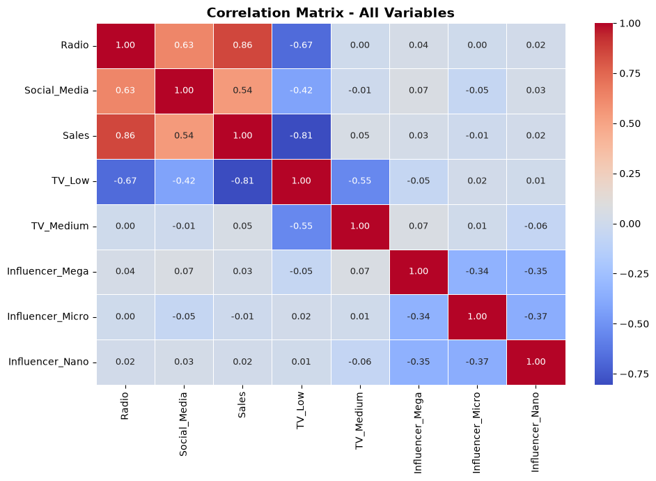
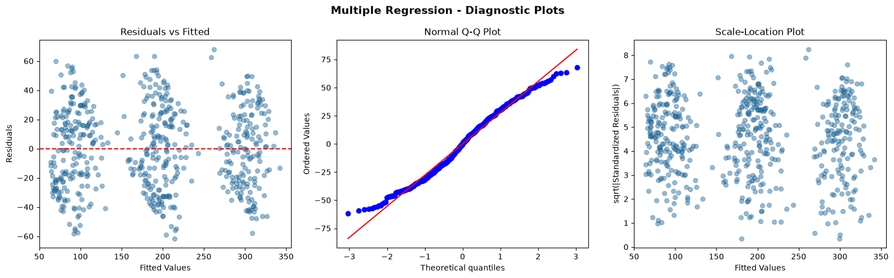

# Multiple Linear Regression Analysis

A statistical analysis of multi-channel marketing data to identify which advertising channels drive Sales and inform budget allocation decisions.

## Overview

This project applies **Multiple Linear Regression (OLS)** to 572 marketing campaign records across TV, Radio, Social Media, and Influencer channels. The goal is to quantify each channel's impact on Sales, check regression assumptions, and produce actionable ROI recommendations.

## Key Findings

| Metric | Value |
|--------|-------|
| R-squared | 0.904 |
| Adjusted R-squared | 0.903 |
| F-statistic | 760.4 (p < 0.001) |
| Observations | 572 |

**Significant predictors:** Radio spend, TV spend level (Low vs High, Medium vs High)

**Not significant:** Social Media spend, Influencer category (Mega, Micro, Nano vs Macro baseline)

### Model Equation

```
Sales = 217.48 + 2.97(Radio) - 0.14(Social_Media) - 154.57(TV_Low)
        - 75.59(TV_Medium) + 2.49(Influencer_Mega) + 2.94(Influencer_Micro)
        + 0.80(Influencer_Nano)
```

### Business Recommendations

1. **Prioritize High TV spend** — Low TV reduces Sales by ~$154,574 compared to High TV.
2. **Increase Radio budget** — Each additional $1,000 in Radio spend is associated with ~$2,974 in Sales.
3. **Deprioritize Social Media** — No statistically significant effect on Sales (p = 0.837).
4. **Influencer type is not a sales driver** — Choose influencers based on cost efficiency, not expected revenue impact.

## Repository Structure

```
multiple-regression-analysis/
├── multiple_regression_analysis.ipynb   # Main analysis notebook
├── multiple_regression_analysis.html    # HTML export of the notebook
├── marketing_sales_data.csv             # Dataset (572 rows, 5 columns)
├── correlation_heatmap.png              # Correlation matrix visualization
├── diagnostic_plots.png                 # Residual diagnostic plots
└── README.md
```

## Dataset

| Column | Type | Description |
|--------|------|-------------|
| `TV` | Categorical | Spend level: Low, Medium, High |
| `Radio` | Numeric | Radio advertising spend |
| `Social Media` | Numeric | Social media advertising spend |
| `Influencer` | Categorical | Influencer tier: Mega, Macro, Micro, Nano |
| `Sales` | Numeric | Revenue generated (target variable) |

The dataset contains **no missing values**.

## Methodology

1. **Data exploration** — Data types, descriptive statistics, missing value checks
2. **Feature encoding** — One-hot encoding for `TV` and `Influencer` (drop-first to avoid dummy variable trap)
3. **Multicollinearity check** — Correlation matrix and Variance Inflation Factor (VIF); all VIF values below 10
4. **OLS modeling** — `statsmodels` multiple linear regression with intercept
5. **Assumption validation** — Residuals vs fitted, Q-Q plot, scale-location plot
6. **Interpretation** — Coefficient, p-value, and R-squared analysis with business recommendations

## Getting Started

### Prerequisites

- Python 3.10+
- Jupyter Notebook or VS Code with Jupyter support

### Install dependencies

```bash
pip install pandas numpy matplotlib seaborn statsmodels scipy nbformat
```

### Run the analysis

Clone the repository and open the notebook from the project root:

```bash
git clone https://github.com/EmmanuelM0147/multiple-regression-analysis.git
cd multiple-regression-analysis
jupyter notebook multiple_regression_analysis.ipynb
```

All file paths in the notebook are relative. Run cells in order from top to bottom.

Alternatively, view the pre-rendered HTML export:

```bash
# Open in your browser
multiple_regression_analysis.html
```

## Visualizations

### Correlation Heatmap



Radio shows the strongest positive correlation with Sales (r = 0.86). TV_Low shows a strong negative correlation (r = -0.81).

### Regression Diagnostic Plots



Residual plots support reasonable linearity, approximate normality, and homoscedasticity for the OLS model.

## Tools Used

- **Python** — pandas, NumPy, Matplotlib, Seaborn
- **Modeling** — statsmodels (OLS), scipy (Q-Q plots)
- **Environment** — Jupyter Notebook

## Author

**Emmanuel M.** — [GitHub](https://github.com/EmmanuelM0147)

## License

This project was completed as an academic assignment. Feel free to use it for learning and reference.
